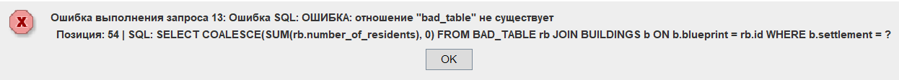
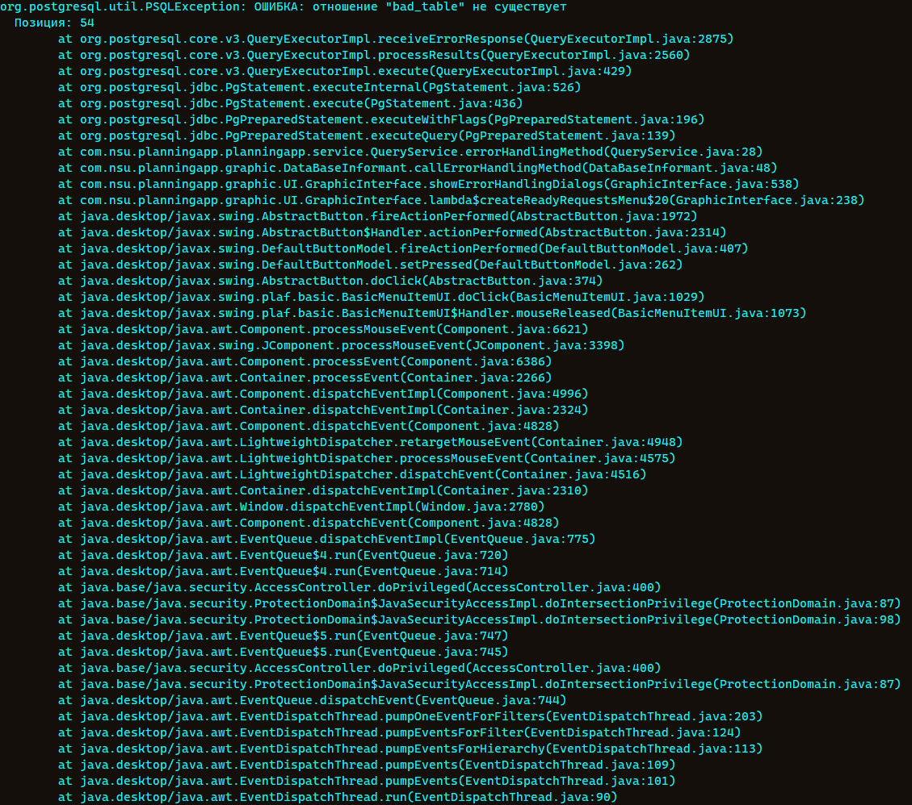

# Домашнее задание 1

## Выбранная уязвимость и приложение

В качестве уязвимости было выбрано 6. Error Handling
Приложение представляет из себя программу для взаимодействия с СУБД. Через графический интерфейс пользователь может отправлять готовые запросы. Логика запросов представлена в коде. В качестве СУБД используется PostgreSQL.

## Суть уязвимости и её вызов

Суть уязвимость Error Handling заключается в том, что при возникновении ошибки раскрывается внутренняя информация (например, текст сообщений СУБД, SQL-запросы, имена таблиц и колонок). У нас это реализовано в методе `errorHandlingMethod()` класса `QueryService` пакета `com.nsu.planningapp.planningapp.service`:
```java
    // Метод с более сильным проявлением Error Handling и обращением к несуществующий таблице БД
    public int errorHandlingMethod(Integer settlementId) throws SQLException {
        String sql = "SELECT COALESCE(SUM(rb.number_of_residents), 0) " +
                    "FROM BAD_TABLE rb " +
                    "JOIN BUILDINGS b ON b.blueprint = rb.id";

        if (settlementId != null)
            sql += " WHERE b.settlement = ?";

        try (Connection conn = DatabaseConnection.getConnection();
             PreparedStatement stmt = conn.prepareStatement(sql)) {
            if (settlementId != null)
                stmt.setInt(1, settlementId);

            ResultSet rs = stmt.executeQuery();
            return rs.next() ? rs.getInt(1) : 0;
        }
        catch (SQLException e) {
            e.printStackTrace(System.out);
            throw new SQLException("Ошибка SQL: " + e.getMessage() + " | SQL: " + sql, e);
        }
    }
```
В самом методе при формировании запроса происходит обращение к несуществующей таблице (`BAD_TABLE`), поэтому всегда срабатывает блок catch. В блоке catch происходит обработка ошибки: в консоль выводим стектрейс и бросаем новую ошибку с сообщением пойманной ошибки и выполняемым запросом. Таким образом пользователь в графическом интерфейсе получает следующие данные:
- имя таблицы - можно сделать вывод, что передается в SQL явно;
- позицию в SQL;
- текст SQL-запроса - раскрывает имена таблиц, колонок и логику соединений;
Из стектрейса можно подтянуть следующее:
- `org.postgresql.util.PSQLException` - СУБД PostgreSQL;
- `core.v3.QueryExecutorImpl` - протокол v3 PostgreSQL;
- `PgPreparedStatement.executeQuery` - запрос происходит через PreparedStatement, а не через Statement;
- архитектуру приложения: названия пакетов, методов, классов, интерфейсов, имена объектов;
- платформа разработки JDK: Swing, AWT, EventQueue.




## Исправление

Суть исправления заключается в том, чтобы показывать пользователю описательную информацию о возникшей проблеме. То есть вместо того, что было, можно, например, вывести "Проблема при обращении к СУБД".
Все остальные методы в классе `QueryService` не имеют этой уязвимости.
